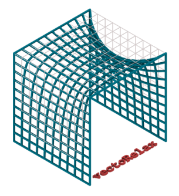

## VectoRelax: A Vectorized NumPy code for Dynamic Relaxtion

Algorithms written by Shervin Azadi & Pirouz Nourian, with contributions from Kotryna Valeckaite, and Puck Flickweert

This repository has been created as an educational resource for the course [EARTHY: Computational Design for Earth Architecture](https://studiegids.tudelft.nl/a101_displayCourse.do?course_id=48987)

The code is mainly inspired by and largely based on the [code samples generously shared by the Block Research Group in ETH Zurich, Prof. Philippe Block, Dr. Tom van Mele et al.](http://block.arch.ethz.ch/blog/2014/07/dynamic-relaxation/).

As explained in [these slides](https://www.researchgate.net/publication/330425376_Dynamic_Relaxation_Force-Directed_Graph_Drawing), our methods is based on the following two references, found thanks to our colleague Ir. Dirk Rinze Visser:

Adriaenssens, S., P. Block, D. Veenendaal, and C. Williams (2014). Shell Structures for Architecture: Form Finding and Optimization. New York: Routledge.
Chapter 2: Review of Dynamic Relaxation with an extension to six degrees of freedom theory by Adriaenssens, S.
